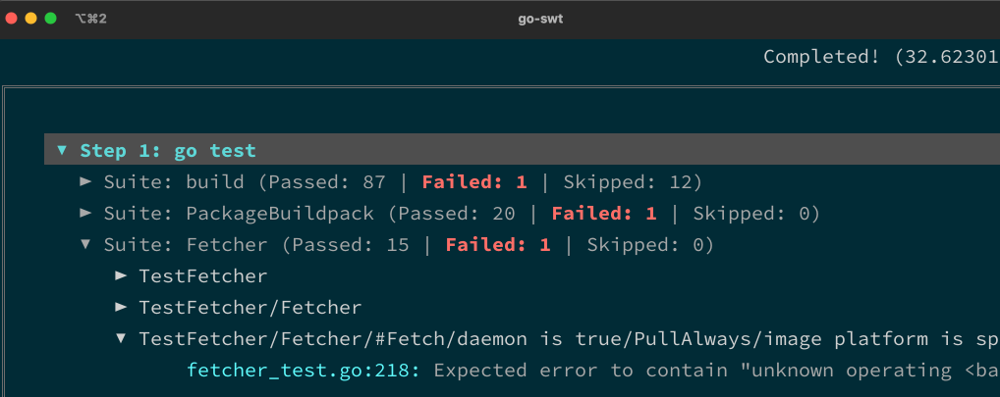

# gswt

A collection of tools to make life easier 😌



## Installation

```shell
# go-swt
go get github.com/aemengo/gswt/cmd/go-swt

# gh-swt
go get github.com/aemengo/gswt/cmd/gh-swt
```

## Usage

### go-swt

**go-swt** (_Golang stop wasting time_) reads stdin and launches a terminal UI for viewing golang test _failures_. Go test must be run in verbose mode.

```shell
go test -v | go-swt
```

### gh-swt

**gh-swt** (_GitHub stop wasting time_) launches a terminal UI for viewing GitHub PR checks and logs. Requires GITHUB_TOKEN environment variable.

```shell
export GITHUB_TOKEN=<my-github-token>
gh-swt buildpacks/pack 1000
```

## Notes

* Golang test parsing assumes the [sclevine/spec](https://github.com/sclevine/spec) BDD test library. Specs must be written with the `report.Terminal{}` spec reporter, like so:

  ```go
  func TestObject(t *testing.T) {
    spec.Run(t, "object", testObject, spec.Report(report.Terminal{}))
  }
  ```

* Hitting `TAB` will use your shell's `$EDITOR` variable to view original log output